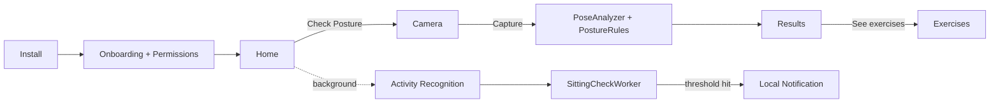

# PostureCoach

Native Android MVP that detects posture issues from a side-profile photo, suggests
corrective exercises, tracks prolonged sitting via Activity Recognition, and nudges
the user to move.

Built with Kotlin, Jetpack Compose, MediaPipe PoseLandmarker, CameraX, Room,
Hilt, WorkManager, and Firebase (Auth + Firestore + FCM).

## Quick start

### 1. Prerequisites
- Android Studio Iguana (2023.2.1) or newer
- JDK 17
- An Android device or emulator running API 26+
- A Firebase project (free tier) for Auth + Firestore + FCM

### 2. MediaPipe pose model
The pose model is bundled at
[`app/src/main/assets/pose_landmarker_lite.task`](app/src/main/assets/pose_landmarker_lite.task)
(~5.5 MB, float16 lite variant). No extra setup needed.

### 3. Configure Firebase (optional but recommended)
1. Create a Firebase project at https://console.firebase.google.com.
2. Add an Android app with package name `com.posturecoach`.
3. Replace `app/google-services.json` with the file downloaded from Firebase.
4. In Firebase Authentication, enable the **Anonymous** sign-in provider.
5. In Firestore, create the database in production mode.

You can also leave the placeholder `google-services.json` in place — the app will
build but cloud sync will be a no-op (Firestore calls are wrapped in safe try/catch).

### 4. Generate the Gradle wrapper (one-time)
The wrapper JAR is intentionally not checked in. Either open the project in
Android Studio (it will create it for you), or run once from a host with a
system Gradle installed:

```bash
gradle wrapper --gradle-version 8.7 --distribution-type bin
```

### 5. Run

```bash
./gradlew :app:installDebug
# or open the project in Android Studio and press Run.
```

## Architecture

- `app/src/main/java/com/posturecoach/`
  - `core/` — theme, common utilities
  - `data/` — Room DB, Firestore sync, repositories, exercises catalog
  - `domain/` — models, pose engine (`PoseAnalyzer`, `PostureRules`), use cases
  - `ui/` — Compose screens (onboarding, home, scan, results, exercises, settings) + nav graph
  - `notification/` — local notifications
  - `service/` — Activity Recognition Transition receiver, accelerometer fallback
  - `work/` — periodic WorkManager jobs (sitting check, daily reminder)
  - `di/` — Hilt modules



## Posture rules

`PostureRules` works from MediaPipe's 33 normalized landmarks (x,y in [0,1]).
Defaults are conservative and live as constants in
[`PostureRules.kt`](app/src/main/java/com/posturecoach/domain/pose/PostureRules.kt):

| Issue              | Metric                                                      | Default threshold |
|--------------------|-------------------------------------------------------------|-------------------|
| Forward head       | `|ear.x − shoulder.x| / torsoLength`                        | `> 0.18`          |
| Rounded shoulders  | angle of shoulder line from horizontal                      | `> 10°`           |
| Slouching          | spine vector tilt from vertical                             | `> 15°`           |

Each rule auto-picks the higher-visibility side, so the same code works for both
left- and right-facing side profiles.

## Tests

```bash
./gradlew :app:testDebugUnitTest          # PostureRules + repositories + formatters
./gradlew :app:connectedDebugAndroidTest  # MainActivity smoke test (needs a device)
```

## Permissions

| Permission              | When           | Why                                                  |
|-------------------------|----------------|------------------------------------------------------|
| `CAMERA`                | Posture scan   | Capture side-profile photo                           |
| `POST_NOTIFICATIONS`    | Onboarding     | Sitting nudges and daily scan reminders              |
| `ACTIVITY_RECOGNITION`  | Onboarding     | Detect STILL vs MOVING transitions                   |
| `FOREGROUND_SERVICE`    | Implicit       | Accelerometer fallback service                       |
| `RECEIVE_BOOT_COMPLETED`| Implicit       | Re-register periodic work after reboot               |

The app gracefully degrades: if Activity Recognition is denied, the sitting card
hides but posture scans keep working.

## Known limitations (MVP)

- Photo-only — no real-time scan
- Pose model assumes a clear side profile, full body in frame, plain background
- Static exercise content (no CMS); GIFs ship as placeholders
- Soft / non-authoritative copy by design — false positives are expected

## Roadmap (post-MVP)

Real-time scanning, wearable integration, personalized AI coaching, gamification,
desktop webcam tracking.
